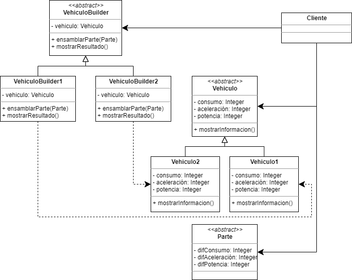

# Modelado plataforma web de concesionaria

## Integrantes
* Laura Alejandra Campos - 20201099028
* Steven Gómez - 20201099030
* Edna Nayibe Palma - 20201099041
* César Augusto Gómez - 20201099031

## Objetivo de la solución
Modelado de plataforma web de concesionaria de vehículos de alta gama, usando UML, la plataforma debe permitir al usuario cambiar la configuración de las partes del vehículo de acuerdo a las posibles existencias para el modelo seleccionado y probar el vehículo en una simulación que informe al usuario sobre:
* El consumo de combustible.
* La aceleración del vehículo.
* La potencia del motor.

## Recursos UML

### Diagrama de casos de uso

### Diagrama de clases
El diagrama de clases se realizó basado en el patrón de diseño **Abstract Factory**.

### Diagrama de actividades

### Diagrama de secuencia

